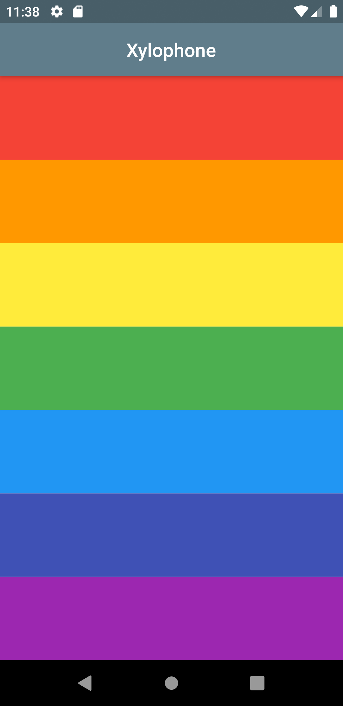

# Xylophone 🎹

* Xylophone is an application which as the name suggests plays different tones.
* It plays different sounds as the different colour buttons are pressed in the application.
* This application provides understanding of how to use third party APIs in an application.
* The entire application is inspired from the course of *Angela Yu* over flutter availabe on Udemy.
* Check out, fork and share reviews.

## Screenshots:

